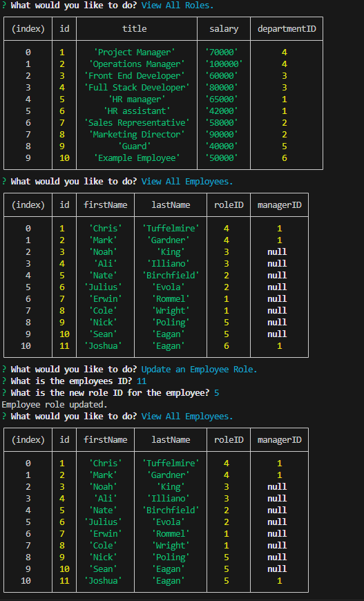

  # HR Control CLI

## Description
This application is intended to be used by Human Resource managers to control the database of the company it is used with. It allows the manager to view all departments, employees and roles of the company as well as add to them to the sql database. It uses Javascript, Node, its inquirer and mysql2 packages and sql files itself.

## Table of Contents
- [Installation](#installation)
- [Usage](#usage)
- [License](#license)
- [Tests](#tests)
- [Questions](#questions)

## Installation
Install the required node modules via 'npm i' in the command line, then run the application using 'node index.js' or 'npm start'.

## Usage
To create easier accsess to the database and allow the manager to edit it via the switches provided.

## License
This project is licensed under the MIT license.
For more information, please visit https://opensource.org/licenses/MIT

## Tests
3

## Questions
For any questions, please contact me at [JoshuaPEagan@outlook.com](mailto:JoshuaPEagan@outlook.com).

GitHub: [KaiserGandros](https://github.com/KaiserGandros)

